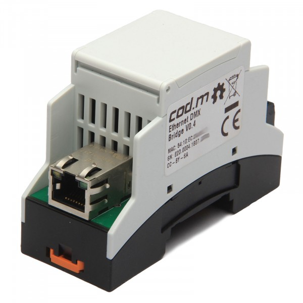

# Ethernet DMX Bridge

The Ethernet DMX Bridge is an open-source hardware solution to generate DMX signals mainly for lightning applications.

It is based on the work from the [LoxForum](https://www.loxforum.com/forum/faqs-tutorials-howto-s/34948-g%C3%BCnstige-und-bessere-alternative-zur-dmx-extension), a german Loxone community. The Software ist mainly developed by Robert Lechner: https://sourceforge.net/p/udptodmx/code/HEAD/tree/trunk/ with extensions from us (cod.m GmbH).
The development of this software has moved to github: https://github.com/LechnerRobert/UDPtoDMX/

The hardware was developed to be a finished product (including CE and RoHS) which can be mounted in a DIN-Rail enclosure - an electric cabinet - so that electricians and alike have not to build their own using some dodgy hardware and perfboards.

To buy one, visit https://shop.codm.de/module/8/ethernet-dmx-bridge-v0.4

## Hardware

We've built it with a wide input voltage range (7-36V), protection for the RS485/DMX-Bus and an easy to use DHCP option with an unique EUID48. Also we've added a short circuit protection.

The second big thing was power consumption. We are currently using not more tha 0.34W for the complete unit. Achieved is this by using WizNets W5500 instead of the (older) W5100 and by using the original MAX485 from Maxim.

You can read about the built in Patrik Mayer's blog: https://allgeek.de/2018/07/22/professionelle-ethernet-dmx-bridge-udp/ (german)

## Software

We've used mainly the original software from Robert but extended it for the EUDI48 use and maintaining the DHCP IP address. 

For the network part we rely on Paull Stoffregens marvelous ethernet library, which is meanwhile the one shipped with the arduino IDE by default.
As this library currently does not have a way to set the ethernet hostname, we've [forked](https://github.com/codm/Ethernet) the library and added it. 

Please follow Robert's instructions on compiling and use our version of the libraries when enabling certain features.

## Legal

We hereby don't allow to reproduce the hardware without our consent. If you wan't to use the schematics and or board in your own private project, feel free. But don't use any of this in a commercial manner without contacting us!

(c) cod.m GmbH, 2018, Germany - CC-BY-SA
